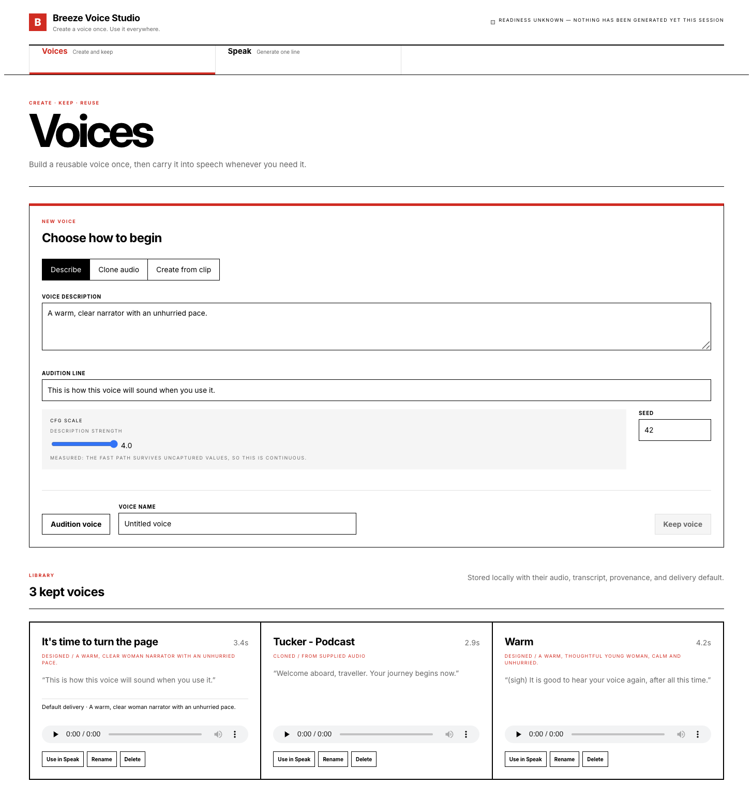
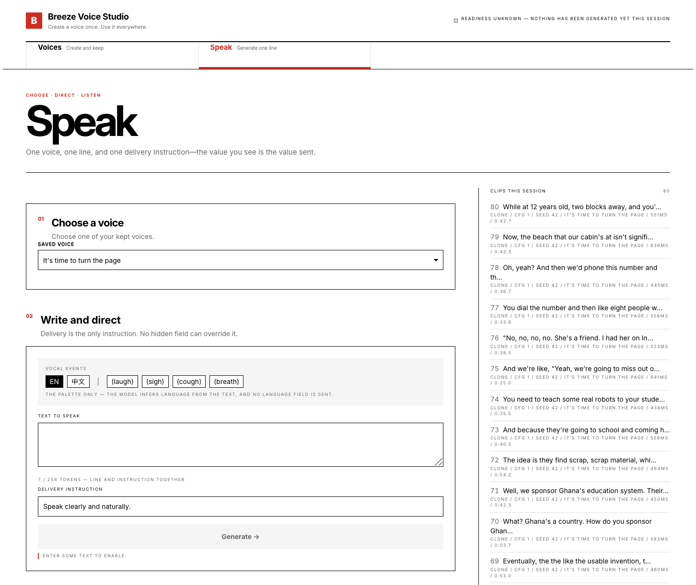

# Breeze TTS 2 — a demo you can hear

A local demo of [BreezeBlue/Breeze-TTS-2](https://huggingface.co/BreezeBlue/Breeze-TTS-2),
a 3B open-weight bilingual (EN/ZH) TTS model. GPU inference runs serverless on
Modal; a local gateway holds the credential and absorbs the audio-format chores;
a browser UI plays 24 kHz PCM **as it arrives**, so end-to-end first-audio time is
observed rather than inferred from the model's published benchmark.

The current implementation model is
[`docs/models/architecture.md`](docs/models/architecture.md). The original,
pre-implementation design investigation is retained as a clearly retired record in
[`_tkr_kit/breeze-tts-2-modal-brief.md`](_tkr_kit/breeze-tts-2-modal-brief.md).



## Shape

```
browser ──► gateway (localhost) ──► Modal ──► GPU
   │             │                    proxy auth at the edge
   │             ├─ holds Modal-Key / Modal-Secret; the browser never sees them
   │             ├─ stages and transcribes each reference once; trims at send time
   │             ├─ tees generated PCM to disk while streaming
   │             └─ serves the UI, so CORS never arises
   └─ AudioWorklet plays s16le PCM as it arrives
```

| Directory | What lives there |
|---|---|
| `infra/` | The Modal image, weights Volume, serving class, and deployment config |
| `bench/` | The measurement harness and the cfg fall-off probe; findings land in `bench/findings/` |
| `gateway/` | The local Node service: credential custody, transports, clip cache, voice library, script runner |
| `ui/` | The browser surface. Voices and Speak are active; the implemented Scripts and temporary-reference paths are capability-gated off |

## Getting it running

### Before you start

You need, and the setup cannot make for you:

- **A [Modal](https://modal.com) account with billing attached.** The synthesis
  service runs on an H100 and transcription on an L4; a new workspace may need
  to request GPU access. Both apps are billed per second while a container is
  warm, and synthesis holds a 10-minute warm window after each request. The
  weights occupy roughly 11 GB of Volume storage. Every idle gap longer than
  the window costs a cold start of about three minutes on the next request.
- **Acceptance of the weights' licence.** Breeze-TTS-2 is research and
  non-commercial (see *Licence posture* below). The model is ungated, so no
  Hugging Face account is needed to fetch it.
- **A machine with Node 20.11+, [uv](https://docs.astral.sh/uv/) and,
  for microphone capture and non-WAV uploads, ffmpeg.** The setup checks all
  three and names the missing one. Its install hints assume Homebrew on
  macOS; on Linux, use your package manager for the same tools.

The guided path does the four steps below in order, asking only for what it
cannot find out itself:

```bash
npm run setup                # add `-- --no-start` to configure without starting
```

It checks Node, uv and ffmpeg, creates `.venv`, signs the Modal CLI in if it is
not, creates the proxy token pair (or takes a pasted one and refuses an `ak-`/`as-`
API token in place), deploys synthesis and, on request, transcription, reads the
deployed URLs back through the Modal SDK, writes `.env` owner-only, builds the
UI and starts the gateway. Every phase detects whether it is already done, so a
rerun after a failure resumes where it stopped. The two phases that spend GPU
time — deploying and measuring — wait for an explicit yes.

The same steps by hand:

### 1. Credentials

The service sets `requires_proxy_auth`, which closes the endpoint to everyone
including you until a token pair exists. The pair is CLI-scriptable, not a
dashboard errand:

```bash
modal workspace proxy-tokens create --json     # → a wk-/ws- pair
cp .env.example .env                           # then fill in the three values
```

`MODAL_KEY`/`MODAL_SECRET` must carry the `wk-`/`ws-` prefixes. An `ak-`/`as-`
*API* token authenticates to nothing here; both the gateway and the bench refuse
it at startup rather than letting it surface as a 401 at your first synthesis.

### 2. Deploy the GPU service

```bash
uv venv .venv --python 3.12 && uv pip install --python .venv/bin/python modal huggingface_hub structlog
modal run   infra/weights.py       # one-off: fills the Volume with 7.7 GB of weights
modal deploy infra/service.py      # prints the endpoint URL → MODAL_ENDPOINT_URL
```

Transcription is a **separate app**, so that reference audio can be transcribed
rather than typed. It is optional — without it, intake still works and you type
the transcript yourself:

```bash
modal run   infra/asr_weights.py   # one-off: 3.1 GB onto the *same* Volume
modal deploy infra/asr.py          # prints the endpoint URL → MODAL_ASR_URL
```

Separate because the two want opposite postures. Synthesis is interactive and
holds a 10-minute warm window on an H100; transcription fires once at the start
of a sitting, so it takes an L4 and a 2-minute window — a long one would idle a
GPU through the whole session it is not wanted for. Both read the same proxy
token pair, which is workspace-wide.

GPU type, warm window and auth are one configuration surface in
`infra/config.py`, overridable by environment:

```bash
BREEZE_GPU=L40S BREEZE_SCALEDOWN_WINDOW_S=600 modal deploy infra/service.py
```

Changing the GPU needs **no image rebuild** — FlashAttention comes from a
prebuilt multi-arch wheel rather than the vendor's Hopper-pinned source build.

### 3. Measure, before believing anything

Deployment baselines come from `bench/findings/`; per-clip first-audio time is
observed by the browser when the first sample is handed to playback. Until a
baseline exists, the UI says "not yet measured" rather than quoting someone
else's H100 benchmark, and it offers conservative CFG presets rather than a
slider whose behaviour is unverified.

The checked-in CFG and reference-ceiling findings describe the current graph
shape. `latency.json` predates the batch-4 warmup extension: its warm TTFA and RTF
remain useful, but its `warmup_ms` is historical and its cold sample was rejected.
The current deployment captured 69 graphs in 162.6 seconds and reached roughly
170 seconds to ready according to container logs; client-observed cold TTFA has
not yet been recorded.

```bash
.venv/bin/python -m bench.harness --warm-runs 5   # → bench/findings/latency.json
.venv/bin/python -m bench.cfg_probe --repeats 5   # → bench/findings/cfg-falloff.json
.venv/bin/python -m bench.reference_probe         # → bench/findings/reference-ceiling.json
```

### 4. Run the demo

```bash
npm --prefix ui install && npm --prefix ui run build
npm --prefix gateway install && npm --prefix gateway start
# → http://127.0.0.1:8787
```

The gateway serves the built UI from its own origin. For UI development,
`npm --prefix ui run dev` proxies `/api` to the gateway instead.



## Tests

```bash
PYTHONPATH=. .venv/bin/python -m pytest infra/tests bench/tests   # 134
npm --prefix gateway test                                          # 220
npm --prefix ui test                                               # 194
```

None of them need a GPU, an external network, or a deployed service: the Modal
SDK is only constructed and all upstream services are injected. Three stream
abort tests deliberately bind an ephemeral `127.0.0.1` port because only a real
socket exposes a response that fails after its headers are committed. The
reference-intake tests use the real `ffmpeg`, because a container-detection test
against a made-up header would pass while the real thing failed.

## Things worth knowing

**Cold start is the interaction most likely to misrepresent this model.** The
current service loads 7.7 GB of weights and captures 69 CUDA graphs before Modal
routes traffic. That reached roughly 170 seconds in container logs and is paid
again after every gap longer than the 10-minute scaledown window. Hiding it
behind a spinner turns "serverless is waking" into "the model is slow", so it is
a named state. Until client-observed cold TTFA is measured, the state says so and
shows only the recorded warm figure.

**Readiness is inferred from idle time, never polled.** `GET /health` on a
scaled-to-zero container *starts* one — polling it to find out whether a cold
start is due would cause the cold start it was checking for, and keep an H100
resident while you read the screen.

**Clips and voices have separate lifetimes on purpose.** Clips are exhaust and
get evicted oldest-first at a size limit. A voice owns its own copy of the
audio, so it survives eviction of the clip it came from. The model has no
saved-voice primitive — no embedding, no voice id — so a voice can only persist
as reference audio plus its exact transcript, and that store is entirely local.

**One request per script cue is forced, not chosen.** The model supports
multi-turn dialogue with a per-turn `speaker_id`, but `breeze_infer/api.py`
exposes only `text`, `instruction`, `cfg_scale`, `ref_audio`, `ref_text` and
`seed`, and `templates.py` hardcodes speaker `S0`. Cues are cached on
text + voice + instruction + cfg + seed, so correcting one line in a forty-line
script costs one GPU request rather than forty. Common voice, delivery, CFG, and
seed behavior live at the script level; explicit cue overrides stay independent.

The script store, queue, exports, and UI are implemented and tested, but Scripts
is not part of the active navigation. `WORKSPACE_AVAILABILITY` is the product
gate; changing that gate is a product decision, not a documentation workaround.

**Drift is reported, never corrected.** Where a cue came from a timed VTT, the
generated duration is shown against its slot with the difference. There is no
time-stretch and no pitch correction anywhere in this codebase: the three honest
responses are reroll, shorten, or accept.

## Licence posture

The inference code is Apache-2.0. **The weights are BreezeBlue Research &
Non-Commercial.** An unauthenticated public `.modal.run` endpoint serving them
is a materially different act from running them on a laptop, which is why
`requires_proxy_auth` defaults on and the gateway checks at startup that an
unauthenticated request to the endpoint is actually refused.
